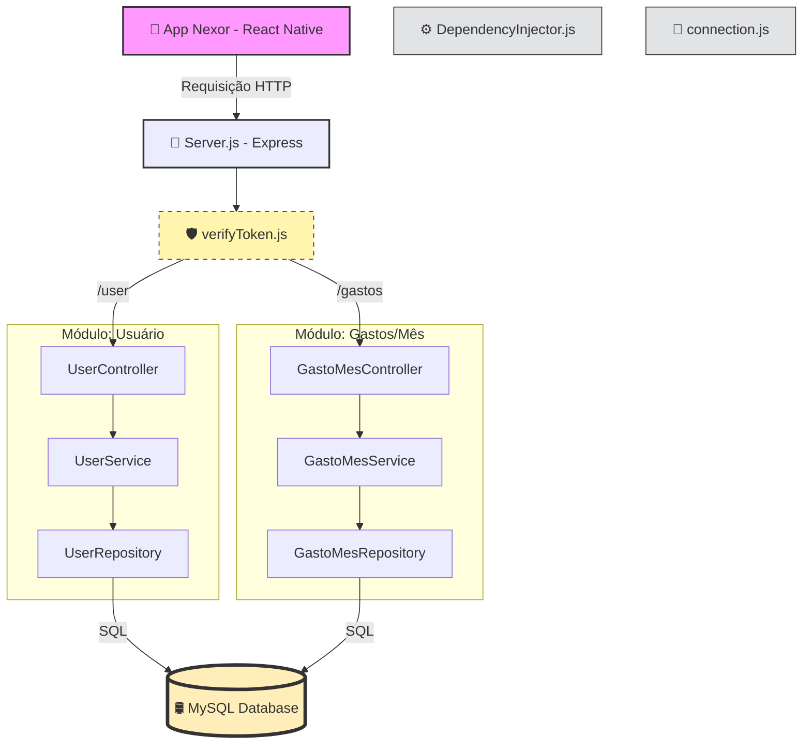

```mermaid
graph TD
    %% Definição dos Nós
    Client[📱 App Nexor - React Native]
    Entry[🚀 Server.js - Express]
    AuthMid[🛡️ verifyToken.js]
    Database[(🛢️ MySQL Database)]
    
    DI[⚙️ DependencyInjector.js]
    DBConn[🔌 connection.js]

    %% Fluxo de Entrada e Segurança
    Client -->|Requisição HTTP| Entry
    Entry --> AuthMid

    %% Módulo de Usuário
    subgraph ModuloUsuario [Módulo: Usuário]
        UC[UserController]
        US[UserService]
        URep[UserRepository]
        
        UC --> US --> URep
    end

    %% Módulo de Gastos
    subgraph ModuloGastos [Módulo: Gastos/Mês]
        GC[GastoMesController]
        GS[GastoMesService]
        GRep[GastoMesRepository]
        
        GC --> GS --> GRep
    end

    %% Conexões de Rotas
    AuthMid -->|/user| UC
    AuthMid -->|/gastos| GC

    %% Persistência
    URep -->|SQL| Database
    GRep -->|SQL| Database

    %% Estilização (Manual para evitar erros de sintaxe)
    style Client fill:#f9f,stroke:#333,stroke-width:2px
    style Entry fill:#ececff,stroke:#333,stroke-width:2px
    style AuthMid fill:#fff5ad,stroke:#333,stroke-dasharray: 5 5
    style Database fill:#ffeeba,stroke:#333,stroke-width:4px
    style DI fill:#e2e3e5,stroke:#333
    style DBConn fill:#e2e3e5,stroke:#333
```