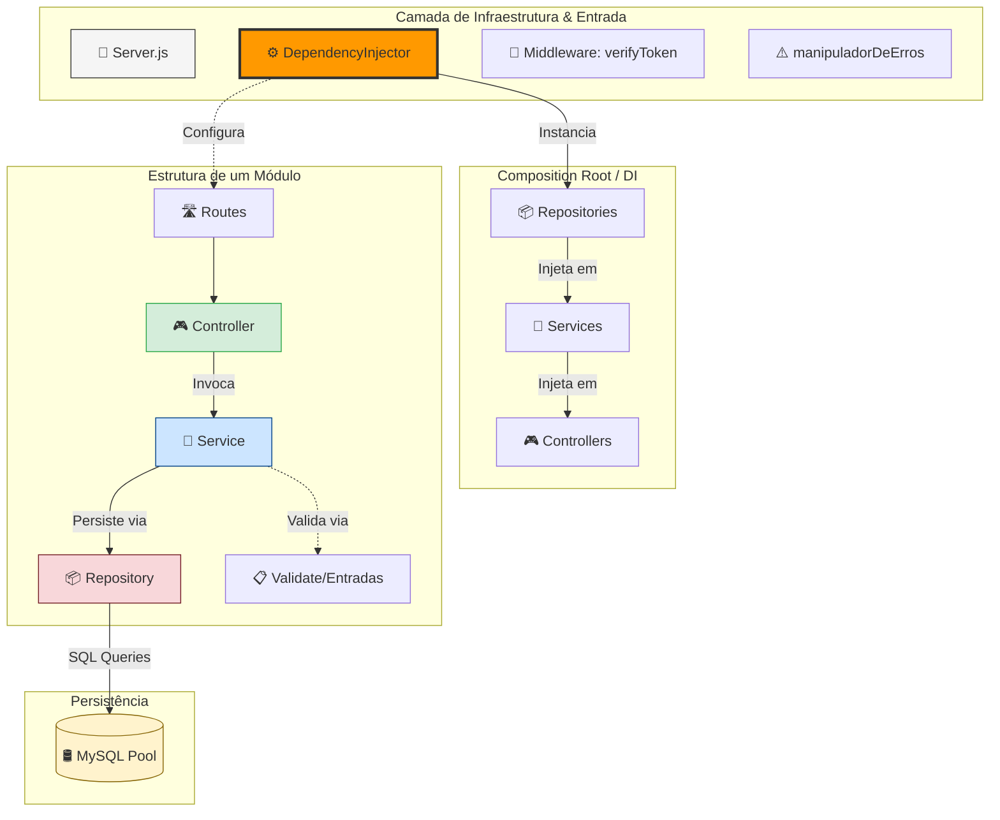

```mermaid
graph TD
    %% Camada de Infraestrutura e Entrada
    subgraph Infra [Camada de Infraestrutura & Entrada]
        Server[🚀 Server.js]
        DI[⚙️ DependencyInjector]
        Auth[🔐 Middleware: verifyToken]
        ErrorH[⚠️ manipuladorDeErros]
    end

    %% Composition Root (O coração do seu projeto)
    subgraph CompositionRoot [Composition Root / DI]
        DI -->|Instancia| Repos[📦 Repositories]
        Repos -->|Injeta em| Servs[🧠 Services]
        Servs -->|Injeta em| Contrs[🎮 Controllers]
    end

    %% Camadas Lógicas de um Módulo (ex: Gastos)
    subgraph ModuleLogic [Estrutura de um Módulo]
        direction LR
        Routes[🛣️ Routes] --> Controller[🎮 Controller]
        Controller -->|Invoca| Service[🧠 Service]
        Service -->|Persiste via| Repository[📦 Repository]
        Service -.->|Valida via| Validate[📋 Validate/Entradas]
    end

    %% Base de Dados
    subgraph DataPersistence [Persistência]
        Repository -->|SQL Queries| DB[(🛢️ MySQL Pool)]
    end

    %% Fluxo de Dependência (Injeção)
    DI -.->|Configura| Routes

    %% Estilos de Cores
    style Server fill:#f5f5f5,stroke:#333
    style DI fill:#ff9900,stroke:#333,stroke-width:3px
    style Controller fill:#d4edda,stroke:#28a745
    style Service fill:#cce5ff,stroke:#004085
    style Repository fill:#f8d7da,stroke:#721c24
    style DB fill:#fff3cd,stroke:#856404
```